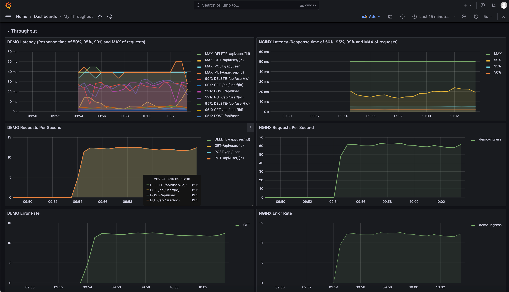
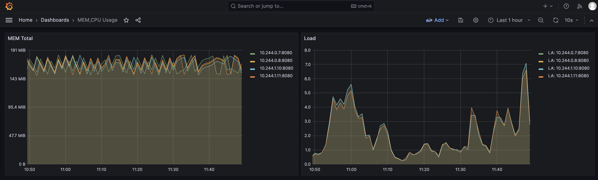
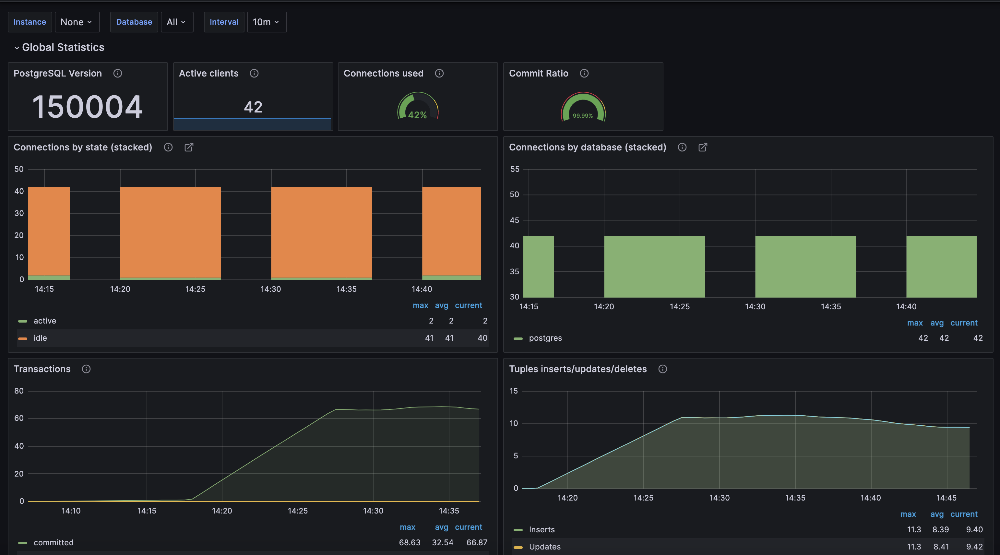

```
helm repo add ingress-nginx https://kubernetes.github.io/ingress-nginx/ && \
helm repo add prometheus-community https://prometheus-community.github.io/helm-charts \
helm repo update
```

```
kubectl create namespace m && \
helm install prom prometheus-community/kube-prometheus-stack -f prometheus.yaml --atomic -n m && \
helm install pgexport prometheus-community/prometheus-postgres-exporter -n m -f postgres_exporter.yml && \
helm install nginx ingress-nginx/ingress-nginx -n m -f nginx-ingress.yaml --atomic \
    --set controller.metrics.enabled=true \
    --set-string controller.podAnnotations."prometheus\.io/scrape"="true" \
    --set-string controller.podAnnotations."prometheus\.io/port"="10254"
```

```
helm show values prometheus-community/prometheus-postgres-exporter -n m
```

```
git clone -b 11-Prometheus https://github.com/dimarudik/otus.git
cd otus
helm upgrade --install app ./k8s/ --wait --atomic -n m
```

```
kubectl port-forward service/prometheus-operated 9090 -n m
kubectl port-forward service/prom-grafana 9000:80 -n m
kubectl port-forward service/nginx-ingress-nginx-controller 8080:80 -n m
```

```
http://localhost:9090
http://localhost:9000
```

```
newman run postman/11-Prometheus.postman_collection.json --iteration-count 14000
```
[DEMO Dashboard](https://raw.githubusercontent.com/dimarudik/otus/11-Prometheus/grafana/MicrometerSpringThroughput.json)



[CPUMEM Dashboard](https://raw.githubusercontent.com/dimarudik/otus/11-Prometheus/grafana/MEM_CPU_Usage.json)



[PG Dashboard](https://raw.githubusercontent.com/dimarudik/otus/11-Prometheus/grafana/prompg.json)

